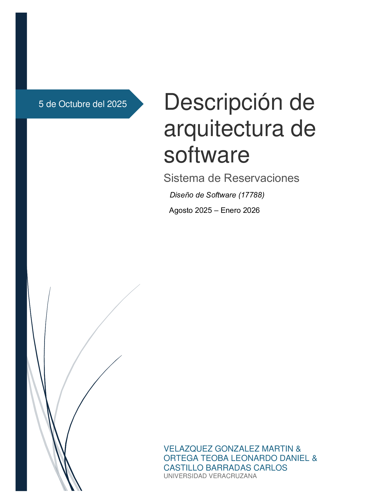

:doctype: book
:toc: left
:sectnums:
:icons: font
:source-highlighter: highlight.js
:imagesdir: images
:lang: es

:chapter-label: Capítulo
:appendix-caption: Apéndice
:part-signifier: Parte
:figure-caption: Figura
:table-caption: Tabla
:example-caption: Ejemplo
:listing-caption: Listado
:caution-caption: Precaución
:important-caption: Importante
:note-caption: Nota
:tip-caption: Consejo
:warning-caption: Advertencia

include::version.adoc[]
include::introduction.adoc[]
include::glosary.adoc[]
include::requirements.adoc[]
include::usecases.adoc[]
include::qualities.adoc[]

include::views/context.adoc[]
include::views/functional.adoc[]
include::views/information.adoc[]
include::views/concurrency.adoc[]
include::views/deployment.adoc[]
include::views/operational.adoc[]
include::views/appendix.adoc[]
include::architectureDrivers/constrains.adoc[]
include::architectureDrivers/concerns.adoc[]
include::designMethod/ADD-CBSE.adoc[]
include::businessConceptModel/justification.adoc[]
include::views/logicalView/justification.adoc[]
include::views/implementationView/interfaces.adoc[]