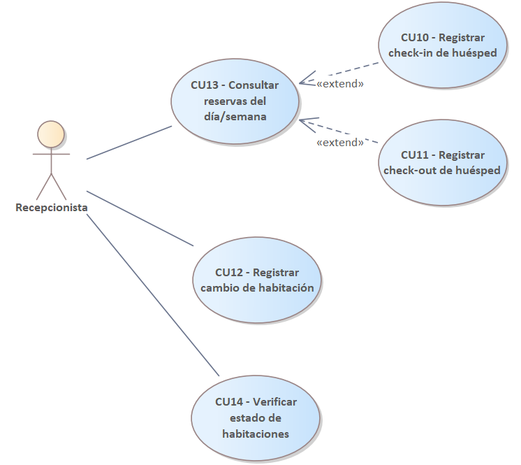
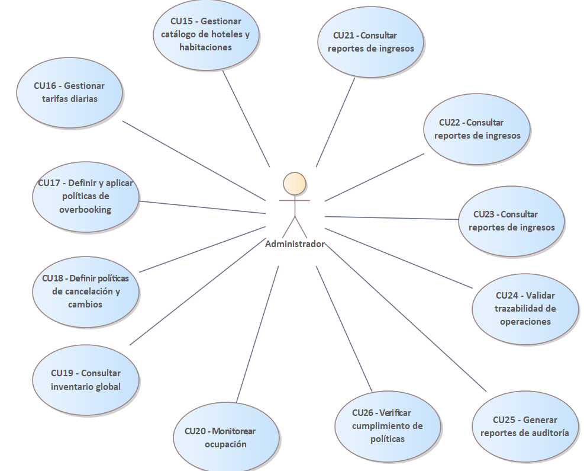

[[context-view]]
== Vista de Contexto

La vista de contexto delimita las fronteras del sistema, identificando qué es parte del sistema y qué es externo a él (actores y sistemas vecinos). Esta vista es crucial para entender el alcance y las interacciones de alto nivel.

=== Diagrama de Contexto

El siguiente diagrama muestra al Sistema de Gestión Hotelera como una caja negra en el centro, rodeado por los actores humanos y sistemas externos con los que interactúa.

=== Actores y Casos de Uso Principales

A continuación se detallan las funcionalidades principales agrupadas por actor, lo que nos permite entender los requisitos funcionales desde la perspectiva de quien interactúa con el sistema.

==== 1. Actor: Huésped
El cliente final del hotel. Sus interacciones se centran en la autosuficiencia (reserva, consulta y pago).

image::../images/CU_Huesped.png[Casos de Uso Huésped, width=600, align=center]

==== 2. Actor: Recepcionista
Personal operativo encargado de la gestión presencial y telefónica. Sus casos de uso requieren eficiencia y acceso rápido a la información de estancias.

==== 3. Actor: Administrador
Encargado de la configuración estratégica del negocio (tarifas, catálogo, usuarios).

[[dfd-view]]
== Diagramas de Flujo de Datos (DFD)

Los DFDs ilustran cómo fluye la información a través de los procesos del sistema, mostrando las entradas, salidas y almacenes de datos.

=== DFD del Administrador

.DFD Administrador N1 (Gestión Hotel)
image::../images/DFD/DFD_administrador1.png[DFD Administrador 1, width=600, align=center]

.DFD Administrador N2 (Gestión Admin y Categorías)
image::../images/DFD/DFD_administrador2.png[DFD Administrador 2, width=600, align=center]

.DFD Administrador N4 (Gestión Hotel)
image::../images/DFD/DFD_administrador4.png[DFD Administrador 4, width=600, align=center]

=== DFD del Administrador de Hotel

.DFD AdministradorHotel N1 (Gestión Productos y Categorías de Productos)
image::../images/DFD/DFD_administradorhotel1.png[DFD AdministradorHotel 1, width=600, align=center]

.DFD AdministradorHotel N2 (Gestión Servicios y Categorías de Servicio)
image::../images/DFD/DFD_administradorhotel2.png[DFD AdministradorHotel 2, width=600, align=center]

.DFD AdministradorHotel N3 (Gestión Empleados)
image::../images/DFD/DFD_administradorhotel3.png[DFD AdministradorHotel 3, width=600, align=center]

=== DFD del Huésped

.Diagrama de flujo de datos del Huésped
image::../images/DFD/huesped.png[DFD Huesped, width=600, align=center]

=== DFD del Recepcionista

.Diagrama de flujo de datos del Recepcionista
image::../images/DFD/recepcionista.png[DFD Recepcionista, width=600, align=center]

=== DFD del Auditor

.Diagrama de flujo de datos del Auditor
image::../images/DFD/auditor.png[DFD Auditor, width=600, align=center]