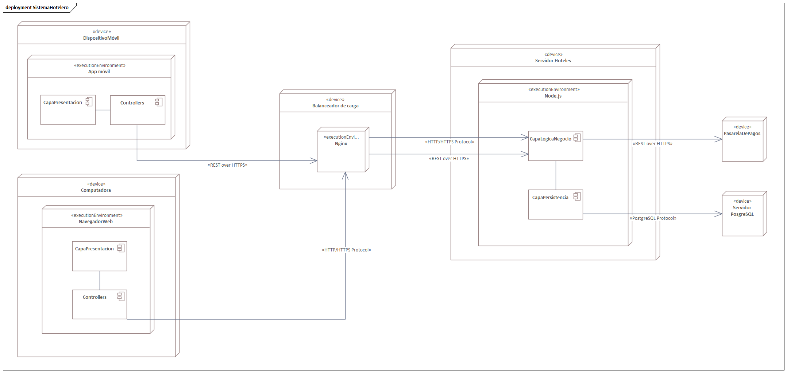

== Vista de despliegue

La vista de despliegue se centra en representar las relaciones entre los artefactos del sistema y los nodos en los que estos se ejecutan. En este tipo de diagramas se muestran los elementos de hardware que soportan la operación del software diseñado; en este caso, el SUD corresponde a una aplicación web construida bajo una arquitectura en capas. No obstante, antes de detallar la vista de despliegue, resulta útil explicar previamente los diagramas de manifestación.

A partir de este punto, el sistema se describe bajo el supuesto uso de las siguientes tecnologías:

React para la capa de presentación (front-end)

Node.js para la capa de aplicación (back-end)

Prisma como ORM

PostgreSQL como base de datos relacional

La estructura base propuesta para el sistema sería la siguiente:

| src/ +
|- api/ +
|- persistence/ +
|- presentation/ + 
|-- views/ 
|-- components/

La carpeta api/ concentraría la capa de lógica de negocio, actuando como la manifestación de los componentes previamente definidos, y comunicándose con la capa de persistencia ubicada en persistence/, donde se gestionan los modelos y la lógica asociada al ORM (con la recomendación de utilizar Prisma).

Por su parte, la carpeta presentation/ correspondería a la capa de presentación, conteniendo tanto las vistas (views/), que representan lo que el usuario final observa, como los componentes (components/), que en React funcionan como unidades reutilizables de código.

=== Diagramas de manifestación

Como punto de partida en la vista de manifestación, se presenta el componente SistemaCadenaHotel. Este se organiza en el directorio hotelChainSystem, donde se incluyen tanto la definición de su comportamiento como la clase encargada de implementarlo. Debido a que JavaScript no incorpora interfaces de manera nativa, las abstracciones correspondientes se representan mediante clases abstractas.
La clase HotelChainManager requiere a HotelManager.js para integrarse con las funciones descritas previamente dentro del modelo.

image:../images/manifestation/sistemaCadenaHotel.png[align=center, width=600]

El siguiente componente corresponde al SistemaHotel, el cual agrupa diversas capacidades internas del sistema. Todas las clases incluidas dentro de este módulo son accesibles a través de HotelSystem, que actúa como punto de entrada para las funcionalidades ofrecidas.

image:../images/manifestation/SistemaHotel.png[align=center, width=600]

En el caso del SistemaHuesped, su estructura es más compacta: dentro de guestSystem se definen tanto la abstracción de la funcionalidad (clase abstracta) como la clase que la implementa. No obstante, esta implementación depende de ReservationManager, a fin de habilitar la gestión de reservas desde este módulo.

image:../images/manifestation/SistemaHuesped.png[align=center, width=600]

De manera natural, esto enlaza con el SistemaReservación, ubicado en reservationSystem. Este módulo incorpora la fachada encargada de interactuar con la PasarelaDePagos, así como la fachada GuestFacade proveniente del SistemaHotel. Con ello se transfiere íntegramente la responsabilidad del procesamiento de pagos al componente especializado correspondiente.

image:../images/manifestation/SistemaReservacion.png[Malign=center, width=600]

Siguiendo el flujo operativo, se llega al módulo de SistemaEstancia, donde se gestionan las estancias activas. Su manifestación se observa en StayManager y en su abstracción asociada. Este componente depende de las fachadas de la PasarelaDePagos, de ReservationManager y de GuestFacade, con el fin de realizar sus procesos internos.

image:../images/manifestation/SistemaEstancia.png[align=center, width=600]

Por último, se encuentra la capa de presentación, que corresponde a lo que finalmente se entrega al usuario en el navegador. Es pertinente señalar que los elementos ubicados en components/ pertenecen al ecosistema de React y no a los componentes del sistema lógico.
El archivo routes.jsx define las rutas utilizadas para la navegación entre vistas.

image:../images/manifestation/CapaPresentacion.png[align=center, width=600]

=== Diagrama de despliegue

La vista de despliegue muestra la interacción entre el navegador del usuario y la capa de presentación desarrollada con React, la cual se comunica mediante HTTP/HTTPS con el servidor donde residen tanto la capa de lógica de negocio como la capa de persistencia, ejecutadas en un entorno Node.js.

Cuando el huésped realiza un pago, sus datos son enviados desde la capa de negocio a la pasarela correspondiente mediante servicios REST sobre HTTPS, asegurando la confidencialidad de la transacción.

A su vez, la capa de persistencia interactúa con el servidor PostgreSQL usando el protocolo propio del motor de base de datos.

El resultado es una representación clara de la arquitectura por capas aplicada correctamente en el sistema.

=== Explicación de la estructura y justificación arquitectónica

La estructura mostrada en el diagrama refleja de manera clara la aplicación de una arquitectura en capas, un estilo ampliamente utilizado en sistemas distribuidos y aplicaciones web modernas. En este caso, la separación entre presentación, lógica de negocio y persistencia no solo responde a una decisión de diseño, sino que constituye un mecanismo fundamental para garantizar atributos de calidad como mantenibilidad, escalabilidad, seguridad y disponibilidad.

En primer lugar, la **capa de presentación**, implementada con React, cumple la función de ofrecer una interfaz interactiva y dinámica al usuario final. La elección de React se justifica por su capacidad de modularizar la interfaz en componentes reutilizables, lo que facilita la evolución del sistema sin comprometer la estabilidad del resto de la aplicación. Este enfoque contribuye directamente a la mantenibilidad, ya que las vistas pueden modificarse o ampliarse sin necesidad de alterar la lógica interna. Además, la separación entre vistas y componentes permite un control más granular sobre la experiencia de usuario, favoreciendo la usabilidad y la consistencia visual.

La **capa de aplicación**, desarrollada en Node.js, concentra la lógica de negocio y actúa como intermediaria entre la presentación y la persistencia. Su papel es crucial para garantizar la coherencia de las operaciones, ya que encapsula las reglas de negocio y asegura que las interacciones con los datos se realicen de manera controlada. Node.js, al ser un entorno orientado a eventos y altamente escalable, permite manejar múltiples solicitudes concurrentes con eficiencia, lo que se traduce en un mejor desempeño bajo cargas elevadas. Este atributo es especialmente relevante en escenarios de calidad relacionados con el rendimiento y la capacidad de respuesta del sistema.

La **capa de persistencia**, gestionada mediante Prisma como ORM y PostgreSQL como motor de base de datos, asegura la integridad y consistencia de la información. Prisma facilita la abstracción de las operaciones sobre la base de datos, reduciendo la complejidad del acceso a los datos y disminuyendo la probabilidad de errores. PostgreSQL, por su parte, ofrece robustez, soporte para transacciones y capacidades avanzadas de consulta, lo que contribuye a la confiabilidad y disponibilidad del sistema. La interacción entre estas tecnologías garantiza que los datos se almacenen y recuperen de manera eficiente, cumpliendo con escenarios de calidad relacionados con la precisión y la consistencia.

El **diagrama de despliegue** muestra cómo estas capas se distribuyen en distintos nodos: el navegador del usuario, el servidor de aplicación y el servidor de base de datos. Esta distribución responde al estilo arquitectónico en capas, donde cada nivel se ejecuta en un entorno especializado. El navegador se limita a la presentación, el servidor Node.js concentra la lógica y la persistencia, y el servidor PostgreSQL se dedica exclusivamente al almacenamiento. Esta separación física refuerza atributos como la seguridad, ya que las credenciales y operaciones críticas se mantienen en el servidor, mientras que el cliente solo interactúa con datos procesados. Asimismo, la modularidad de la distribución facilita la escalabilidad horizontal: es posible replicar servidores de aplicación o bases de datos para atender mayor demanda sin alterar la lógica interna.

En cuanto a los **atributos de calidad**, la arquitectura propuesta contribuye de manera directa a varios escenarios relevantes:

- **Mantenibilidad**: la separación en capas y directorios (`api/`, `persistence/`, `presentation/`) permite localizar y modificar funcionalidades específicas sin afectar el resto del sistema.
- **Escalabilidad**: Node.js y PostgreSQL soportan la ampliación de recursos y la distribución de carga, lo que asegura que el sistema pueda crecer conforme aumente el número de usuarios.
- **Seguridad**: el uso de HTTPS en la comunicación entre cliente y servidor protege la confidencialidad de las transacciones, especialmente en el caso de pagos. Además, la delegación de la gestión de pagos a una pasarela especializada reduce riesgos asociados al manejo directo de información sensible.
- **Disponibilidad**: la separación de responsabilidades entre nodos facilita la implementación de redundancia y balanceo de carga, asegurando que el sistema continúe operativo incluso ante fallos parciales.
- **Rendimiento**: la arquitectura en capas, junto con tecnologías orientadas a eventos, permite responder con rapidez a múltiples solicitudes concurrentes, garantizando tiempos de respuesta adecuados.

Finalmente, la estructura propuesta refleja fielmente el estilo arquitectónico elegido porque cada componente cumple un rol específico dentro de la capa que le corresponde. El diagrama de despliegue no solo ilustra la interacción entre los nodos, sino que también evidencia cómo las decisiones de diseño se alinean con los objetivos de calidad del sistema. En conjunto, la arquitectura en capas aplicada al Sistema Hotelero asegura que la solución sea robusta, flexible y capaz de evolucionar en el tiempo, respondiendo a las necesidades tanto funcionales como no funcionales de la organización.