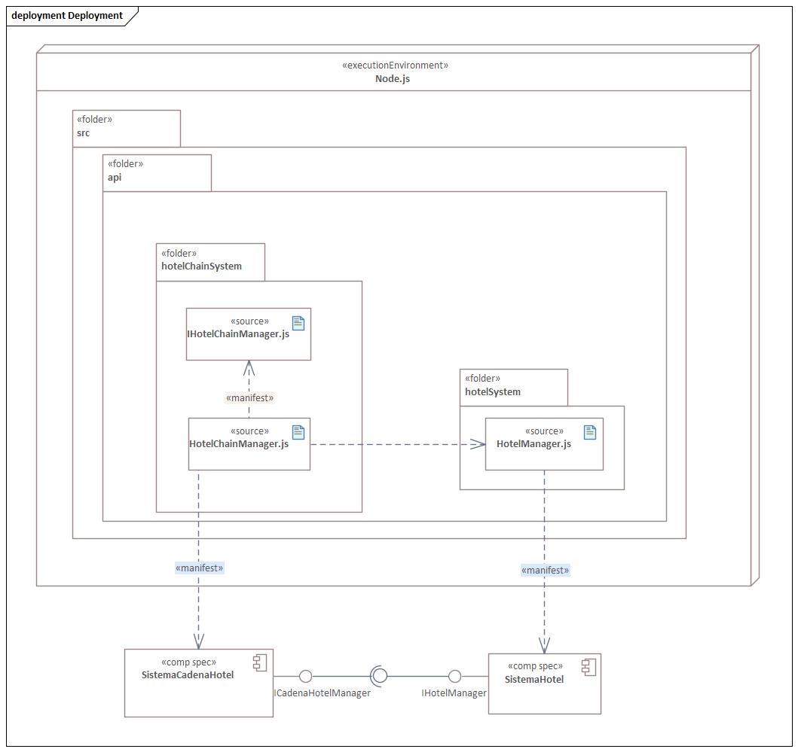
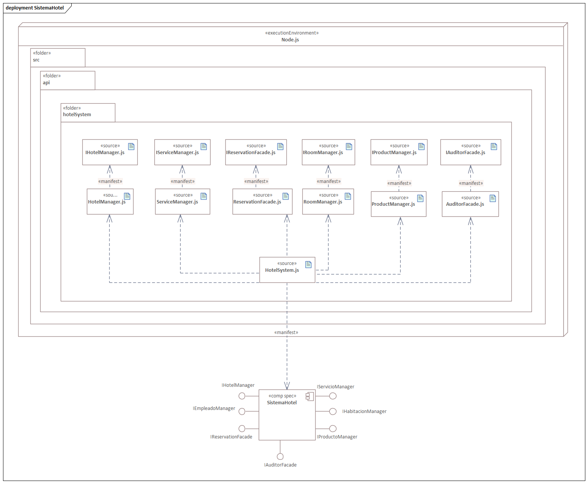
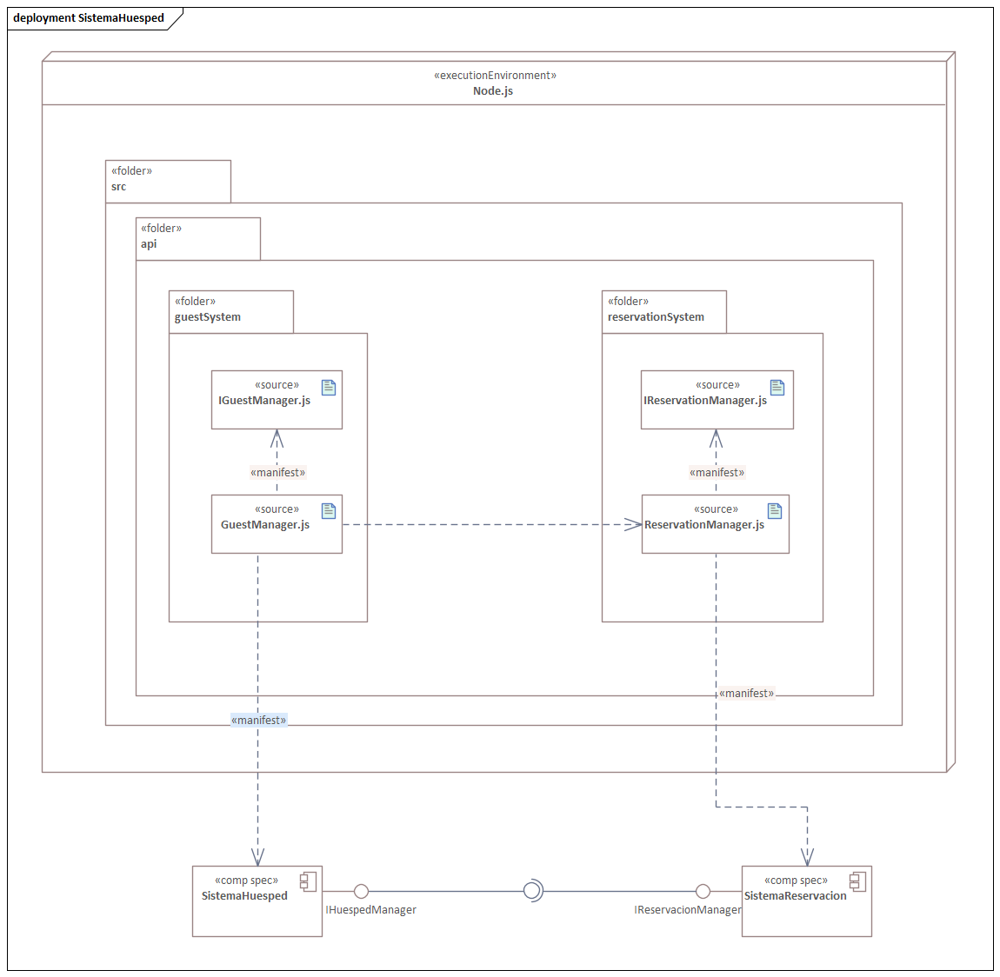
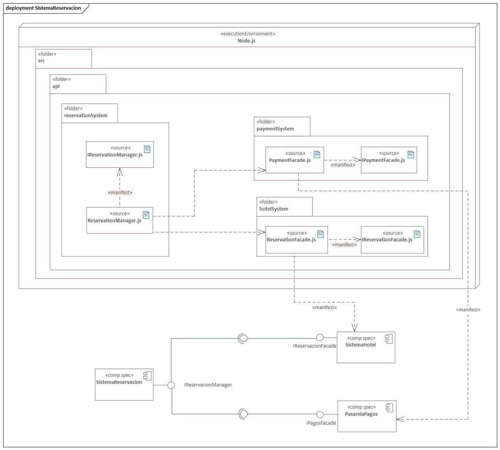
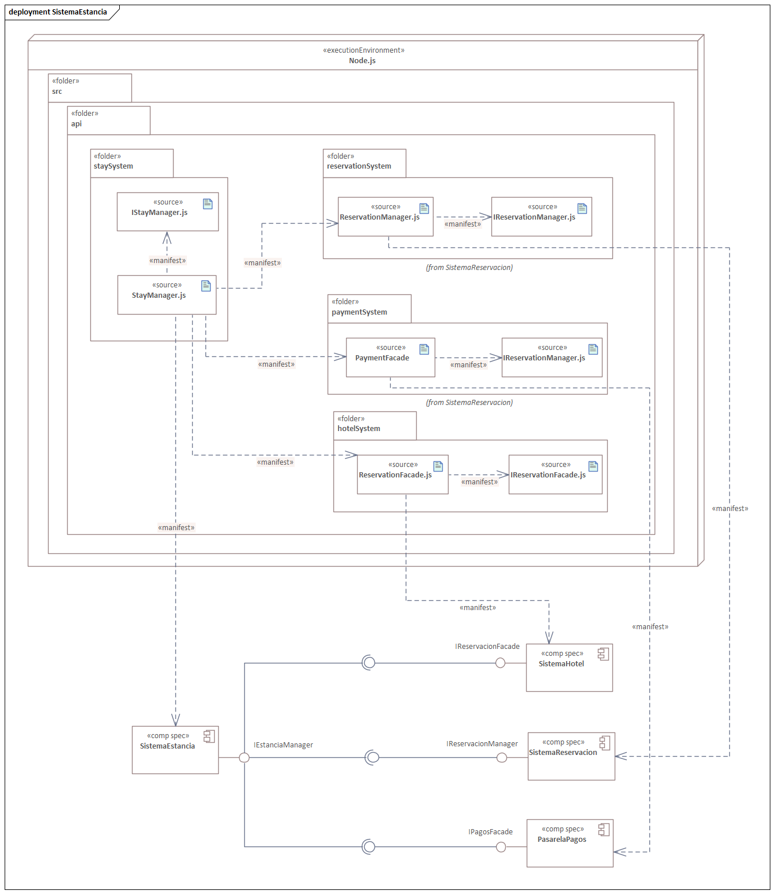
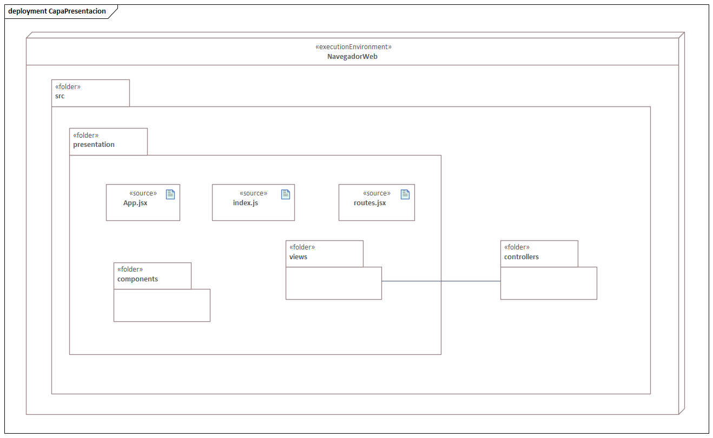

== Vista de despliegue

La vista de despliegue se centra en representar las relaciones entre los artefactos del sistema y los nodos en los que estos se ejecutan. En este tipo de diagramas se muestran los elementos de hardware que soportan la operación del software diseñado; en este caso, el SUD corresponde a una aplicación web construida bajo una arquitectura en capas. No obstante, antes de detallar la vista de despliegue, resulta útil explicar previamente los diagramas de manifestación.

A partir de este punto, el sistema se describe bajo el supuesto uso de las siguientes tecnologías:

React para la capa de presentación (front-end)

Node.js para la capa de aplicación (back-end)

Prisma como ORM

PostgreSQL como base de datos relacional

La estructura base propuesta para el sistema sería la siguiente:

| src/ +
|- api/ +
|- persistence/ +
|- presentation/ + 
|-- views/ 
|-- components/

La carpeta api/ concentraría la capa de lógica de negocio, actuando como la manifestación de los componentes previamente definidos, y comunicándose con la capa de persistencia ubicada en persistence/, donde se gestionan los modelos y la lógica asociada al ORM (con la recomendación de utilizar Prisma).

Por su parte, la carpeta presentation/ correspondería a la capa de presentación, conteniendo tanto las vistas (views/), que representan lo que el usuario final observa, como los componentes (components/), que en React funcionan como unidades reutilizables de código.

=== Diagramas de manifestación

Como punto de partida en la vista de manifestación, se presenta el componente SistemaCadenaHotel. Este se organiza en el directorio hotelChainSystem, donde se incluyen tanto la definición de su comportamiento como la clase encargada de implementarlo. Debido a que JavaScript no incorpora interfaces de manera nativa, las abstracciones correspondientes se representan mediante clases abstractas.
La clase HotelChainManager requiere a HotelManager.js para integrarse con las funciones descritas previamente dentro del modelo.

El siguiente componente corresponde al SistemaHotel, el cual agrupa diversas capacidades internas del sistema. Todas las clases incluidas dentro de este módulo son accesibles a través de HotelSystem, que actúa como punto de entrada para las funcionalidades ofrecidas.

En el caso del SistemaHuesped, su estructura es más compacta: dentro de guestSystem se definen tanto la abstracción de la funcionalidad (clase abstracta) como la clase que la implementa. No obstante, esta implementación depende de ReservationManager, a fin de habilitar la gestión de reservas desde este módulo.

De manera natural, esto enlaza con el SistemaReservación, ubicado en reservationSystem. Este módulo incorpora la fachada encargada de interactuar con la PasarelaDePagos, así como la fachada GuestFacade proveniente del SistemaHotel. Con ello se transfiere íntegramente la responsabilidad del procesamiento de pagos al componente especializado correspondiente.

Siguiendo el flujo operativo, se llega al módulo de SistemaEstancia, donde se gestionan las estancias activas. Su manifestación se observa en StayManager y en su abstracción asociada. Este componente depende de las fachadas de la PasarelaDePagos, de ReservationManager y de GuestFacade, con el fin de realizar sus procesos internos.

Por último, se encuentra la capa de presentación, que corresponde a lo que finalmente se entrega al usuario en el navegador. Es pertinente señalar que los elementos ubicados en components/ pertenecen al ecosistema de React y no a los componentes del sistema lógico.
El archivo routes.jsx define las rutas utilizadas para la navegación entre vistas.

=== Diagrama de despliegue

La vista de despliegue muestra la interacción entre el navegador del usuario y la capa de presentación desarrollada con React, la cual se comunica mediante HTTP/HTTPS con el servidor donde residen tanto la capa de lógica de negocio como la capa de persistencia, ejecutadas en un entorno Node.js.

Cuando el huésped realiza un pago, sus datos son enviados desde la capa de negocio a la pasarela correspondiente mediante servicios REST sobre HTTPS, asegurando la confidencialidad de la transacción.

A su vez, la capa de persistencia interactúa con el servidor PostgreSQL usando el protocolo propio del motor de base de datos.

El resultado es una representación clara de la arquitectura por capas aplicada correctamente en el sistema.

image:../images/Despliegue/SistemaHotelero.png[align=center, width=600]