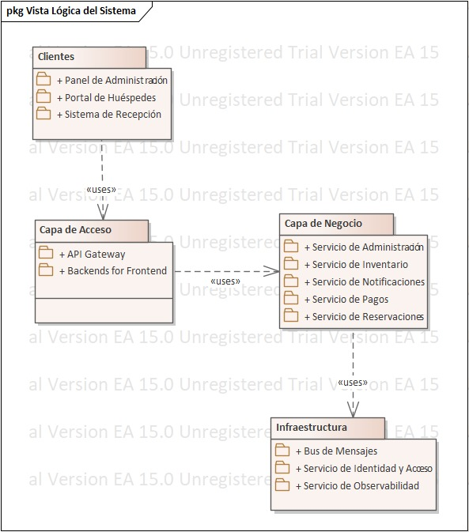

== Vista Lógica

Esta vista describe la estructura estática del sistema y la organización de sus responsabilidades funcionales. Se enfoca en la descomposición del sistema en sus elementos lógicos principales (paquetes o subsistemas), la responsabilidad asignada a cada uno y las relaciones más importantes entre ellos.

El estilo arquitectónico de microservicios, seleccionado para satisfacer impulsores clave como la Mantenibilidad (CRN-07), Escalabilidad (CRN-05) y Disponibilidad (CRN-02), dicta la descomposición principal del sistema. En lugar de una estructura en capas monolítica, el sistema se organiza como una colección de servicios cohesivos y débilmente acoplados, cada uno enfocado en una capacidad de negocio específica.

El diagrama adjunto ilustra la descomposición lógica del sistema en los siguientes paquetes principales:

=== Descripción de Paquetes Principales

[cols="1,3", options="header"]
|===
|Paquete Lógico |Responsabilidades Asignadas

|Clientes (Frontends)
|Contiene las aplicaciones orientadas al usuario final. Siguiendo la decisión de usar el patrón BFF, este paquete se subdivide en:

Portal de Huéspedes (SPA): Interfaz para consulta de disponibilidad, reservas, pagos y gestión de perfil.

Sistema de Recepción: Interfaz para el personal del hotel para realizar check-in, check-out y gestionar estancias.

Panel de Administración: Interfaz para administradores para configurar catálogos, tarifas y consultar reportes.

|Capa de Acceso (Gateways & BFFs)
|Actúa como la fachada principal del sistema. Su responsabilidad es exponer una API unificada y segura para los clientes.

API Gateway: Punto único de entrada. Gestiona el enrutamiento, la autenticación, la seguridad (rate limiting, WAF) y el balanceo de carga inicial.

Backends for Frontend (BFFs): APIs especializadas que orquestan llamadas a los servicios de negocio y adaptan los datos para cada tipo de cliente, simplificando la lógica en el frontend.

|Capa de Negocio (Microservicios)
|Representa el corazón del sistema, donde reside la lógica de negocio principal. Cada sub-paquete es un microservicio independiente con su propia base de datos.

Servicio de Inventario: Gestiona el catálogo de hoteles, tipos de habitación y su disponibilidad en tiempo real. Es la fuente de verdad para la ocupación.

Servicio de Reservaciones: Orquesta el ciclo de vida de una reserva (creación, modificación, cancelación) y aplica las políticas de negocio correspondientes.

Servicio de Pagos: Se integra con la pasarela de pagos certificada (CON-03) para procesar cobros y reembolsos.

Servicio de Notificaciones: Gestiona el envío de comunicaciones (emails, notificaciones push) de forma asíncrona.

Servicio de Administración: Expone operaciones para la gestión de tarifas, promociones y políticas de la cadena.

|Infraestructura
|Proporciona capacidades técnicas compartidas que son utilizadas por múltiples servicios de negocio.

Bus de Mensajes: Implementa la comunicación asíncrona entre servicios (ej. para el patrón Saga y notificaciones).

Servicio de Identidad y Acceso: Se integra con el IdP corporativo (CON-05) y emite tokens de sesión para los usuarios.

Servicio de Observabilidad: Centraliza logs, métricas y trazas de todos los componentes para el monitoreo y diagnóstico de problemas.
|===

=== Relaciones y Dependencias Clave

Los paquetes Clientes dependen exclusivamente de la Capa de Acceso. No tienen conocimiento directo de los microservicios internos.

La Capa de Acceso (específicamente los BFFs) depende de los servicios en la Capa de Negocio para orquestar las operaciones.

Los servicios de la Capa de Negocio son en su mayoría independientes entre sí, comunicándose de forma asíncrona a través de la Infraestructura para mantener la cohesión y minimizar el acoplamiento.

==== Convención de Estereotipos UML de Capas Arquitectónicas

UML no define estereotipos estándar para representar capas arquitectónicas ni estilos arquitectónicos específicos como microservicios, capas lógicas o arquitecturas hexagonales. Sin embargo, el lenguaje proporciona el mecanismo de estereotipos para extender su semántica y adaptar los modelos a dominios específicos.

Siguiendo las recomendaciones de la literatura de arquitectura de software —principalmente Pattern-Oriented Software Architecture (POSA) y Software Architecture in Practice—, este diseño adopta un conjunto de estereotipos personalizados para mejorar la expresividad del modelo y comunicar claramente las responsabilidades de cada capa lógica del sistema.

Estos estereotipos no representan decisiones de despliegue físico ni dependencias tecnológicas concretas, sino roles arquitectónicos y responsabilidades lógicas dentro de la Vista Lógica.

==== Estereotipos Adoptados

[cols="1,3", options="header"]
|===
| Estereotipo | Significado Arquitectónico

| presentation
| Representa la capa de presentación, responsable de la interacción directa con el usuario final. Incluye interfaces gráficas y clientes que consumen APIs, sin contener lógica de negocio ni reglas de dominio. Este estereotipo está alineado con el concepto de Presentation Layer descrito en POSA y con la User Interface Layer en Software Architecture in Practice.

| application
| Representa la capa de aplicación, encargada de coordinar y orquestar los casos de uso del sistema. Esta capa no implementa reglas de negocio centrales, sino que actúa como intermediaria entre la presentación y el dominio. En este sistema, encapsula componentes como el API Gateway y los Backends for Frontend (BFF), siguiendo los patrones Application Layer (SAIP) y Gateway (POSA).

| domain
| Representa la capa de dominio o negocio, donde residen las reglas de negocio, invariantes y políticas fundamentales del sistema. Esta capa constituye el núcleo del sistema y está alineada con los principios de Domain-Driven Design, así como con la Domain Layer descrita en POSA. Cada sub-paquete dentro de esta capa corresponde a un microservicio que representa un Bounded Context independiente.

| infrastructure
| Representa la capa de infraestructura, que provee servicios técnicos transversales como mensajería, autenticación, persistencia y observabilidad. Esta capa no contiene lógica de negocio y su función es soportar técnicamente a la capa de dominio. El estereotipo está alineado con la Infrastructure Layer descrita en DDD y con los Technical Services en POSA.
|===

==== Uso de Estereotipos en la Vista Lógica

Los estereotipos definidos se aplican a los paquetes principales del diagrama de la Vista Lógica con el objetivo de:

* Clarificar las responsabilidades arquitectónicas de cada capa.
* Facilitar la comprensión del diseño por parte de audiencias técnicas y no técnicas.
* Mantener coherencia entre el modelo UML, las decisiones arquitectónicas documentadas (ADR) y el proceso ADD seguido.

La aplicación de estos estereotipos refuerza la trazabilidad entre los impulsores arquitectónicos identificados (escalabilidad, mantenibilidad y disponibilidad) y la estructura modular resultante del sistema, sin introducir dependencias innecesarias ni comprometer la flexibilidad del diseño.

.Diagrama de Paquetes

=== Estructura de Componentes del Sistema

El sistema se estructura en componentes funcionales de alto nivel que colaboran entre sí. La siguiente vista ilustra la arquitectura general y sus interacciones.

image::../images/components/ComponentArchitectureDiagram.jpeg[Diagrama de Arquitectura de Componentes, width=700, align=center]

==== Descripción de Componentes Principales

A continuación se detallan las responsabilidades de los subsistemas identificados:

* **Sistema de Administración** (`Administracion`):
Responsable de la configuración global de la cadena y la gestión corporativa.
image::../images/components/Administracion.jpeg[Componente Administración, width=500]

* **Sistema de Inventario** (`Inventario`):
Gestiona la disponibilidad física de las habitaciones y los catálogos de servicios. Es la fuente de verdad para el estado del hotel.
image::../images/components/Inventario.jpeg[Componente Inventario, width=500]

* **Sistema de Reservaciones** (`Reservaciones`):
Orquesta el proceso de reserva anticipada, validando disponibilidad con Inventario y precios.
image::../images/components/Reservaciones.jpeg[Componente Reservaciones, width=500]

* **Sistema de Gestión de Estancias** (`GestionEstancias`):
Maneja las operaciones en tiempo real dentro del hotel: Check-in, consumos durante la estadía y Check-out.
image::../images/components/GestionEstancias.jpeg[Componente Estancias, width=500]

* **Sistema de Pagos** (`Pagos`):
Actúa como fachada segura para la comunicación con pasarelas bancarias externas, encapsulando la complejidad financiera.
image::../images/components/Pagos.jpeg[Componente Pagos, width=500]

* **Sistema de Autenticación** (`Autenticacion`):
Servicio transversal encargado de la identidad, emisión de tokens y validación de credenciales para huéspedes y empleados.
image::../images/components/Autenticacion.jpeg[Componente Autenticación, width=500]

== Trade-Offs

Como se mencionó anteriormente, el principal trade-off de esta iteración consistió en priorizar la escalabilidad —junto con la posibilidad de incorporar mejoras de seguridad en el futuro— y facilitar el despliegue de dichos cambios. Esto implicó aceptar una reducción en el rendimiento. Sin embargo, se procuró mantener la usabilidad en un nivel óptimo, ya que un sistema lento afecta directamente la experiencia del usuario y podría alejar potenciales clientes, lo cual es contrario a los objetivos del negocio.

== Modelo de Conceptos de Negocio

Esta sección clarifica y define las entidades principales del dominio del problema. Sirve como un vocabulario común para todos los interesados y actúa como la fuente de verdad para el diseño de la capa de negocio, la identificación de componentes CBSE y la posterior vista de datos. El modelo es puramente conceptual, omitiendo detalles de implementación como métodos.

=== Descripción de Conceptos Principales

[cols="1,3", options="header"]
|===
|Concepto |Descripción

|Hotel
|Representa una sucursal física de la cadena. Contiene información como nombre, dirección y un conjunto de habitaciones.

|Tipo de Habitación
|Define una categoría de habitación según sus características (ej. "Doble", "Suite Presidencial"). Es el concepto "vendible" al que se asocian los Planes Tarifarios.

|Habitación
|Es una instancia tangible de un cuarto (ej. "Puerta 305"). Se distingue del Tipo de Habitación porque esta tiene un estado operativo (Sucia, Limpia, Mantenimiento).

|Huésped
|Es la persona que se aloja. Se diferencia del "Cliente/Titular" (quien paga), aunque a menudo sean la misma persona.

|Reservación
|El acuerdo marco del alojamiento. Actúa como un contenedor que agrupa los detalles de las noches reservadas, la cuenta financiera y los huéspedes asignados.

|Detalle de Reservación
|Representa el desglose diario de la reserva (ej. "Noche del Lunes"). Es vital porque fija el precio específico de esa fecha y consume el inventario correspondiente.

|Plan Tarifario
|Combina un precio base con un conjunto de reglas (políticas de cancelación, régimen de alimentos). Permite vender el mismo Tipo de Habitación a diferentes precios y condiciones.

|Inventario Diario
|Entidad crítica para el control de disponibilidad. Representa el cupo total vs. ocupado para un Tipo de Habitación en una Fecha específica. Previene el overbooking.

|Cuenta Huésped (Folio)
|El libro mayor financiero de la reserva. Registra cronológicamente todos los Cargos (noches, consumos) y Abonos (pagos, depósitos). El saldo debe ser cero para permitir el Check-out.

|Política
|Regla de negocio abstracta que condiciona la reserva. Se especializa en Política de Cancelación (penalizaciones), Política de Pago (anticipos) y Restricciones (estancia mínima).
|===

=== Relaciones y Dependencias Clave

1.  **Estructura del Producto:**
    Un Hotel se compone de Tipos de Habitación (Catálogo) y Habitaciones Físicas (Inventario tangible). Cada Habitación Física pertenece a un solo Tipo.

2.  **Venta y Disponibilidad:**
    Una Reservación se compone de múltiples **Detalles de Reservación** (uno por noche).
    Cada Detalle de Reservación está vinculado a un **Inventario Diario**, decrementando la disponibilidad para esa fecha y tipo específico.

3.  **Integridad Financiera:**
    Una Reservación tiene asignada una **Cuenta Huésped** única (relación 1 a 1).
    Los Pagos **NO** se asocian directamente a la reserva, sino que se registran como transacciones de abono dentro de la Cuenta Huésped, afectando su saldo global.

4.  **Reglas de Negocio:**
    La Reservación está regida por un **Plan Tarifario**, el cual determina el precio diario y las Políticas aplicables (cancelación/garantía) vigentes al momento de la compra.

.Modelo de Conceptos de Negocio
image::../images/ModeloDeConceptosDeNegocio.png[Modelo de conceptos de negocio, width=600, align=center]

== Modelo de Tipos de Negocio (MTN)

Siguiendo la metodología de Cheesman & Daniels, el Modelo de Conceptos de Negocio se refina para producir el Modelo de Tipos de Negocio. Este modelo formaliza las definiciones de los datos y las interfaces que el sistema expondrá, estableciendo una distinción clara entre los objetos de valor, los objetos de negocio con identidad y las interfaces encargadas de su gestión.

Para mayor precisión semántica, se utilizan los siguientes estereotipos estándar de la metodología:

* **<<core>>**: Representa los tipos de negocio principales que poseen identidad propia y ciclo de vida independiente. Estos tipos son gestionados directamente por un componente.
* **<<type>>**: Representa tipos de datos o valores que no tienen identidad independiente y solo existen como atributos de un tipo núcleo.
* **<<interface type>>**: Define el contrato abstracto de los objetos de negocio que son expuestos a otros componentes.

=== Estructura de Gestión (Managers y Core Types)

En lugar de exponer las relaciones de negocio como simples asociaciones directas, el diseño introduce **Interfaces de Gestión (Managers)**. Cada <<core>> type es administrado por una interfaz Manager específica, la cual encapsula la lógica de creación, búsqueda y mantenimiento (relación de composición).

A continuación se describen las transformaciones clave aplicadas al modelo:

1.  **Gestión de Reservaciones:**
    El tipo `Reservacion` (<<core>>) no es accesible globalmente de forma directa, sino que es gestionado por la interfaz IReservacionManager. El Manager actúa como la raíz de composición, garantizando que toda operación sobre una reserva pase por las reglas de negocio del componente.

2.  **Inventario y Catálogo:**
    Los tipos Hotel y Habitacion (<<core>>) son administrados por IHotelManager e IInventarioManager respectivamente. La relación de composición indica que el ciclo de vida de una habitación está ligado a la gestión del inventario del hotel.

3.  **Tipos de Valor:**
    Elementos como Tarifa o Politica se modelan como <<type>>, indicando que son objetos de valor inmutables o dependientes que se transmiten a través de las interfaces de los Core Types.

.Modelo de Tipos de Negocio (Con Estereotipos y Managers)
image::../images/modeloTiposNegocio.png[Modelo de Tipos de Negocio, width=700, align=center]